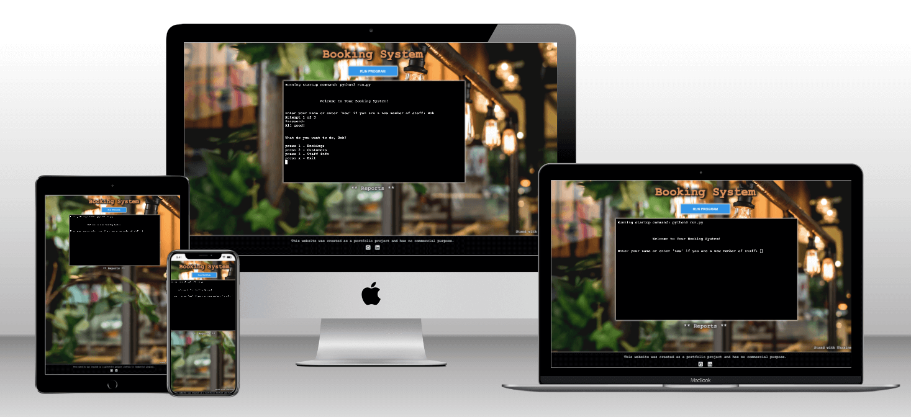

# Restaurant Booking System CLI app(Milestone Project 3)

## Table of contents

* [Purpose](#purpose)

* [UX Design](#UX-Design)
  * [User Stories](#User-Stories)
  * [Structure](#Structure)
  * [Design](#Design)

* [Features](#Features)
  * [Existing Features](#Existing-Features)
  * [Feature Considerations](#Feature-Considerations)

* [Technologies](#Technologies)
  * [Languages](#Languages)
  * [Programs, frameworks, libraries](#Programs,-frameworks,-libraries)

* [Deployment](#Deployment)

* [Testing](#Testing)
  * [User Story Testing](#User-Story-Testing)
  * [Manual Testing](#Manual-Testing)
  * [Unit Testing](#Unit-Testing)
  * [Automated Testing](#Automated-Testing)

* [Credits](#Credits)

# Purpose
This project is a CLI app - Reataurant [Booking System](https://my-wicked-booking-sys.herokuapp.com/). The app provides all the essential features, such as creating, editing and viewing reservations, additionally it allows to log in a member of staff and holds a database of staff members and customers, also it involves some basic data science to generates statictics reports.

The core purposes of the app:
- optimise a process of booking tables and keeping track of reservations.
- collect and store customers' data for future marketing purposes.
- provide staticstical insights into an enterprise current state.  

The website is built using Python, with little HTML and CSS, as a Milestone Project#3 for the Code Institute's Full Stack Developer course.  

[The live website is available here](https://my-wicked-booking-sys.herokuapp.com/)
___