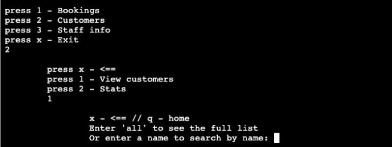

# Restaurant Booking System CLI app(Milestone Project 3)

## Table of contents

* [Purpose](#purpose)

* [UX Design](#ux-design)
  * [User Stories](#user-stories)
  * [Structure](#structure)

* [Features](#features)
  * [Existing Features](#existing-features)
  * [Feature Considerations](#feature-considerations)

* [Flowchart](#flowchart)

* [Technologies](#technologies)
  * [Languages](#languages)
  * [Programs, frameworks, libraries](#programs,-frameworks,-libraries)

* [Deployment](#deployment)

* [Testing](#testing)
  * [User Story Testing](#user-story-testing)
  * [Manual Testing](#manual-testing)
    * [Detected Bugs](#bugs-detected)
  * [Unit Testing](#unit-testing)
  * [Automated Testing](#automated-testing)

* [Credits](#credits)

# Purpose
This project is a CLI app - Restaurant [Booking System](https://my-wicked-booking-sys.herokuapp.com/). The app provides all the essential features, such as creating, editing and viewing reservations. Additionally, it allows the user to log in as a member of staff and holds a database of staff members and customers. It also involves some basic data science to generate statistical reports.

The core purposes of the app:
- optimise the process of booking tables and keeping track of reservations.
- collect and store customers' data for future marketing purposes.
- provide statistical insights into an enterprise's current state.  

The website is built using Python, with little HTML and CSS, as a Milestone Project#3 for the Code Institute's Full Stack Developer course.  

[The live website is available here](https://my-wicked-booking-sys.herokuapp.com/)
___
# UX Design
## User stories
### As a **business owner**

- I want to manage reservations efficiently.
- I want to keep track of history.
- I want a staff database and the ability to see who added the booking, so in case something about a reservation is unclear, it could be confirmed with a person who added it, without spending time trying to find out who it was.
- I want a customers database for marketing purposes
- I want to receive insights from statistic reports for business decisions.

### As a **first time user**

- I want to understand how to use the app.
- I want to understand where in the program I am and what options are available.
- I want to be able to go to the start menu at any point or go back if I have chosen the wrong option.
- I want to access the contact information of other members of staff.
- I want to easily access customers' information to confirm a booking or make changes.
- I want to find, add, confirm, reschedule and cancel a reservation.
- I want to be reminded of bookings to confirm.

### As a **frequent user**

- I want to be able to navigate fast.
- I want to be sure my account is secured with a password.
- I want to be able to change my password.

___

## Structure

Throughout the app the user is guided with clear instructions and can return one step back or to the start menu at any point.
___

# Features
## Existing Features

- **Log in**

Allows the user to log in (by checking a password) or create a new user. The data of existing users is stored in Google Spreadsheets. A member of staff record consists of a name, a password and a contact(phone number) in case there is a need to contact other staff to clarify something about bookings they added.

- **Start Menu**

The Start Menu is an entry point to the program; it allows you to choose between 3 main sections: Bookings, Customers and Staff. At any point in the program further on, the user can go straight back to the Start Menu if they need.

- **Bookings Menu**

The Bookings Menu includes options related to bookings: View bookings, Add booking and Edit bookings.

- **View Bookings Menu**

The View Bookings Menu includes four options for viewing: "Today", "Tomorrow", "a Week", and "All time". Bookings for "Today" are printed in a specific format: with symbols "\/" (if a reservation was confirmed) or "--" (if a reservation needs to be confirmed) and a customer's contact information below to confirm it. Bookings data is obtained from Google Spreadsheet DB.

- **Add Booking**

This section begins with a customer's name request. If the customer doesn't exist, it offers to create a new customer (y/n choice) or try to search for a customer by name again. Having found an existing customer or created a new one, Add Booking function requests a date, time and number of people and writes it to Google Spreadsheets. After a valid date is entered, the program prints out all existing bookings for this date to help the user assess the situation and avoid overbooking. The booking entry has an attribute "created by", so if any doubts or questions regarding a booking arise, it is convenient to contact the person who created it for clarification.

- **Edit Bookings**

The Edit Bookings Menu offers to Confirm, Reschedule or Cancel a booking. 

- **Confirm**

The Confirm function picks all bookings for today that are not confirmed and prints them out, one by one, with a customer's contact information. Having contacted a customer, the user can choose between "Confirmed" (when the reservation is confirmed successfully), "Skip"(when they weren't able to contact the customer) or "Cancel"(when the customer cancelled the reservation on the call).

- **Reschedule**

     

The Reschedule function allows you to change any parameter of the booking entry: date, time and number of people. When a new date is entered, the program prints out all existing bookings for this date to help the user assess the situation and avoid overbooking.

- **Cancel**

The Cancel function cancels a chosen booking. A cancelled booking receives an attribute "cancelled" and remains in the database for analytics purposes.

- **Customers Menu**

The Customers Menu includes options related to customers: View customers and Stats. A new customer function is not in the menu because there is no need to create a customer without a booking, so it gets created along with a new booking.

- **View Customers**

Allows to search customers by name or view the complete list of existing customers if needed.

- **Stats**

Generates a pdf report from business's data, such as age groups of customers, number of bookings per customer and percentage of cancelled bookings. It is saved to Google Drive and is avilable by the [link](https://drive.google.com/drive/folders/1RMQBmiL3ATEkIAtPFmQypM5rcYfzXsD-) below the terminal.

- **Staff Menu**

The Staff Menu includes options related to customers: View Staff Info and Edit Staff Info.

- **View Staff Info**

Allows to search for staff members by name or view the complete list if needed.

- **Edit Staff Info**

Allows changing the user's password or a contact phone number to ensure contact information is always up to date.

- **Data Validation**

Date, time, phone, email and number data are validated throughout the app to ensure only correct format valid data is saved to the database.

- **Google Spreadsheet**

Google Spreadsheet API is used to persist data for the app. There are three worksheets to organise data: "bookings", "customers", and "staff".

- **Web page**

The project requirement was to develop a CLI app, so visual design is not implied. However, I decided to make it a little more eye-pleasing.

## Feature Considerations

### Log of all changes
It would be helpful for business if we could not only see who created a booking but who edited it too.

### Email or SMS reminders

Customers will receive reminders of upcoming bookings via a channel of their choice.

### Birthday greetings

Customers' birthdates are collected to send birthday greetings as well as promo offers for the date. Unfortunately, it was not possible under Heroku limitations. However, could be achieved by setting up [IronMQ](https://elements.heroku.com/addons/iron_mq) service.
___

# Flowchart

`x` - one step back to the previous menu
`q` - back 'home' to the start menu

___

# Technologies
## Languages
- Python, HTML, CSS
## Programs, frameworks, libraries
- [Gitpod](https://gitpod.io/) IDE to develop the app.
- [GitHub](https://GitHub.com/) to host the source code 
- [Heroku](https://www.heroku.com/) to deploy and host the live app.
- Git to provide version control (to commit and push code to the repository). 
- [Google Spreadsheets API](https://developers.google.com/sheets/api) to store data.
- [Google Drive](https://developers.google.com/drive) to write an app to process requests to Spreadsheets.
- [Pandas](https://pandas.pydata.org/) and [Matplotlib](https://matplotlib.org/) for statistic reports.
- [Pytest](https://docs.pytest.org/en/7.1.x/) Pytest for unit-testing.
- [TinyJPG](https://tinyjpg.com/) to optimise images for readme. 
- [Favicon.io](https://www.favicon.io/) to create the website favicon.
- [Techsini](https://tecnisih.com) to create the Mockup image in this README.
- [W3C HTML Markup Validator](https://validator.w3.org/) to validate HTML code.
- [W3C Jigsaw CSS Validator](https://jigsaw.w3.org/css-validator/) to validate CSS code.
- [Markdown Tables Generator](https://www.tablesgenerator.com/) to generate tables for the readme file.
- [PEP 8](http://pep8online.com/) to validate python code.
- [LucidChart](https://lucid.app/documents#/dashboard) for flowcharts.
- Code Institute's Python Template to generate the workspace for the project.

___

# Deployment

## Github
The project was created by navigating to the CI template and clicking 'Use this template'. After a new repository was given a name, I navigated to Gitpod, where the entire project was developed. 

## Version control
Git was used for version control. The following commands were used throughout the project:

dit add . - new (or untracked), deleted and modified files are added to Git staging area
git add <filename> - a specified file is added to Git staging area
git reset - to unstage all files (remove from Git staging area)
git reset -- <filename> - to unstage a specified file
git commit -m "commit message" - to commit changes to the local repository
git push - to push all committed changes to the GitHub repository
git pull - to pull the changes from the remote branch and integrate them with the current local branch
git status - to display the state of the working directory and the staging area
git branch - to display all of the branches in the repository
git checkout -b <branch-name> - to create a new branch
git checkout <branchname> - to switch to the specified branch
git log - to display commits
git revert <first 6 digits of the commit ref>- to "undo" changes, the revert command adds a new commit at the end of the chain to "cancel" changes to the state of the specified commit. This prevents Git from losing history, which is important for the integrity of your revision history and for reliable collaboration.

## Heroku
Heroku was used to host the app. Heroku is a container-based cloud Platform for building, deploying and managing apps. 

### Steps for deployment:

1. Fork or clone this repository.
2. Log into your account on Heroku.
3. Create a new Heroku app.
4. Navigate to `Settings` tab.
5. Set up environmental variables in `config vars` section. In this case, it's CREDS(credentials of Google service account) and PORT(value 8000).
5. Set the buildbacks to `python` and `NodeJS` in that order.
6. Configure GitHub integration, choose `main` branch in the `Deploy` tab.
6. Click `Deploy branch`.

___

# Testing

## User Story Testing
| Expectations                                                                                 | Realisation                                                                                                                                                                                                                                                                                                                                                                                                                          |
|----------------------------------------------------------------------------------------------|--------------------------------------------------------------------------------------------------------------------------------------------------------------------------------------------------------------------------------------------------------------------------------------------------------------------------------------------------------------------------------------------------------------------------------------|
| **As a business owner**                                                                   |                                                                                                                                                                                                                                                                                                                                                                                                                                      |
| I want to manage reservations efficiently. | The booking section provides different operations with bookings, such as add, confirm, reschedule, and cancel. all the changes are stored in a database. And could be accessed by the owner at any point from outside the program.|
| I want to keep track of history.                               | All bookings, customers and staff are written to a database, so even cancelled bookings don't get deleted, and this information could be used for business analytics.                                                                                                                                                                                                                                  |
| I want a staff database and the ability to see who added the booking.  | 1. The database holds the contact information of staff, so they can be contacted if needed. Without keeping a separate list somewhere else.   2. Every booking entry has information about who created it.                       |
| I want a database of customers for marketing purposes.                                                                       | 1. The database of customers holds information about customers that could be used to offer additional services and for marketing purposes.  2. Customer entry includes name, phone number and email, for reminders, and birthdate to send birthday greetings with marketing promotions.                                                                                                                                                 |
| I want to receive insights from statistic reports.                             | Statistic reports cover different aspects of business and could be expanded. Visualisation is easy to read and understand.                                                                                           |
| As a **first time user**                                                       |                                                                                                                                                                                                                                                                                                                                                                                                                                      |
| I want to understand how to use the app.                      | The app includes clear instructions.                                                                                                                                                                            |
| I want to understand where in the program I am and what options are available.                | 1. The names of menu options are coherent.   2.There is indentation for menus of different depths, which  helps to navigate comfortably.                                                                                                                                                                                                                                                    |
| I want to be able to go to the start menu  at any point or go one step back.                                                               | At any point the user can go one step back or to the  start menu and abort any operation if the situation has  changed or they have chosen a wrong option by mistake.  It provides swift navigation throughout the app.                                                                                                                                                                     |
| I want to access the contact information  of other staff members.   | Staff section of the app provides this opportunity.                                                                                                                                                                ||
| I want to easily access customers' information  to confirm a booking or make changes.                      | The contact information of a customer is printed out with  a booking that needs confirmation, so the user does not  need to search it. However, if needed, customers' information  can be found in the View Customers section.                                                                                                                                                         ||
| I want to find, add, confirm, reschedule  and cancel a reservation.                     | All the options are available in the Bookings section of the app.                                                                                                                                                                            ||
| I want to be reminded of bookings to confirm.                      | When the user views booking for today, bookings that  require confirmation are highlighted and the customer's contact  information is provided.                                                                                                                                                                            |
| As a **frequent user**                                                                               |                                                                                                                                                                                                                                                                                                                                                                                                                                      |
| I want to be able to navigate fast.            | Navigation with number keys is convenient and easy to find  and memorise. The most relevant sections are number one  on the menu.                                                                                ||
| I want to be sure my account is secured  with a password.            | Users are encouraged to use their accounts to be able  to track who made changes or created a booking, to  ensure that, personal accounts are protected by a password.                                                                                ||
| I want to be able to change my password.            | This option is provided in the Edit Staff Info menu.                                                                                |
___
   
## Manual Testing

The app was manually tested in Chrome, Safari and Firefox on MacBook.

### Bugs detected:
#1 - I often have issues with an internet connection. Most of the time, it is handled as an Exception. However, sometimes when the connection gets interrupted during the response from Spreadsheets, which is considered successful, the data is not received: this case does not fall under the exception and the response results in None, which crashes the program. I could replicate it twice.

Solution: raise an Error if a response is None, so it falls under the exception.

## Unit testing

Feature testing was performed through automated unit-testing using [Pytest](https://docs.pytest.org/en/7.1.x/contents.html).
To run the tests: install the project's dependencies (`pip install -r requirements.txt`) and use the command `pytest` in the terminal. 
Find the screenshots below:

## Automated Testing

1. **[W3 Markup Validation](https://validator.w3.org/) - HTML Validation**

All pages were run through HTML Validator. No errors were detected.

2. **[W3 Jigsaw](https://jigsaw.w3.org/css-validator/) - CSS Validation**

CSS Stylesheet was run through CSS Validator. No errors were detected.

3. **[PEP 8](http://pep8online.com/) - Python Validation**

All pages were run through PEP 8. No errors were detected.

___

# Credits

## Media

- Background image is by @patrick-schneider from [Unsplash](https://unsplash.com).
- favicon.ico was created by me. 

## Code

- Guidance on Python 3 was obtained from [Python Documentation](https://docs.python.org/3/).
- A deeper understanding of Python and Data Science basics was obtained from [ZTM Python Course](https://zerotomastery.io/courses/learn-python/).
- A deeper understanding of Python and testing was obtained from [CS50's Introduction to Programming with Python](https://cs50.harvard.edu/python/2022/weeks/5/).
- Understanding of Google Spreadsheet API was obtained from [Gspread Documentation](https://docs.gspread.org/en/latest/index.html).
- Understanding of Pytest was obtained from [Pytest Documentation](https://docs.pytest.org/en/7.1.x/contents.html).
- Understanding of mocking was obtained from [Unittest Documentation](https://docs.python.org/3/library/unittest.mock.html#module-unittest.mock).
- Guidance on mocking in Python testing was obtained from [realpython.com](https://realpython.com/python-mock-library/).
- Guidance on mocking in Python testing was obtained from [toptal.com](https://www.toptal.com/python/an-introduction-to-mocking-in-python).
- Code snippet for email validation was taken from [geeksforgeeks.org](https://www.geeksforgeeks.org/check-if-email-address-valid-or-not-in-python/).
- Code snippet for date string validation is taken from [Stackoverflow](https://stackoverflow.com/questions/16870663/how-do-i-validate-a-date-string-format-in-python).
- Code snippet for phone number validation is taken from [Stackoverflow](https://stackoverflow.com/questions/16699007/regular-expression-to-match-standard-10-digit-phone-number).
- Understanding of Matplotlib was obtained from [Matplotlib Documentation](https://matplotlib.org/stable/index.html).
- Understanding of Matplotlib was obtained from [stackabuse.com](https://stackabuse.com/matplotlib-histogram-plot-tutorial-and-examples/).
- Guidance on saving multiple figures in Matplotlib and code snippet were obtained from [here](https://www.tutorialspoint.com/saving-multiple-figures-to-one-pdf-file-in-matplotlib).
- Understanding of different figures in Matplotlib was obtained from [here](https://books.google.pt/books?id=kOU6EAAAQBAJ&pg=RA2-PA15&lpg=RA2-PA15&dq=matplotlib+pie+chart+group+data+cut&source=bl&ots=2eoeGMK_OT&sig=ACfU3U2iv6akCDShJDhth9weHnROphlfYg&hl=en&sa=X&ved=2ahUKEwiq8uiyraj5AhUEgM4BHVUUAdUQ6AF6BAgmEAM#v=onepage&q=matplotlib%20pie%20chart%20group%20data%20cut&f=false).

## Acknowledgements

I would like to thank CI Slack Community and my mentor, Ronan McClelland, for guidance, moral support and patience. 
